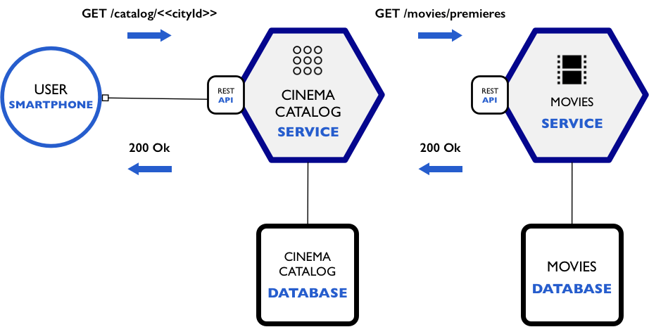

<div align="center"><a href="#"></a></div>

# Cinema Microservices
Tem como objetivo exemplificar a criação de micro-serviços com NodeJS.

---

#### Arquitetura

<div align="center"><a href="#"></a></div>

---

#### Dependências
- NodeJs
- yarn || npm
- MongoDB
- express
- helmet
- morgan
- supertest

---

#### Comandos
###### Executar Testes
```shell
    npm test
```

###### Executar servidor
```shell
    npm start
```

---

## Francisco Viana


